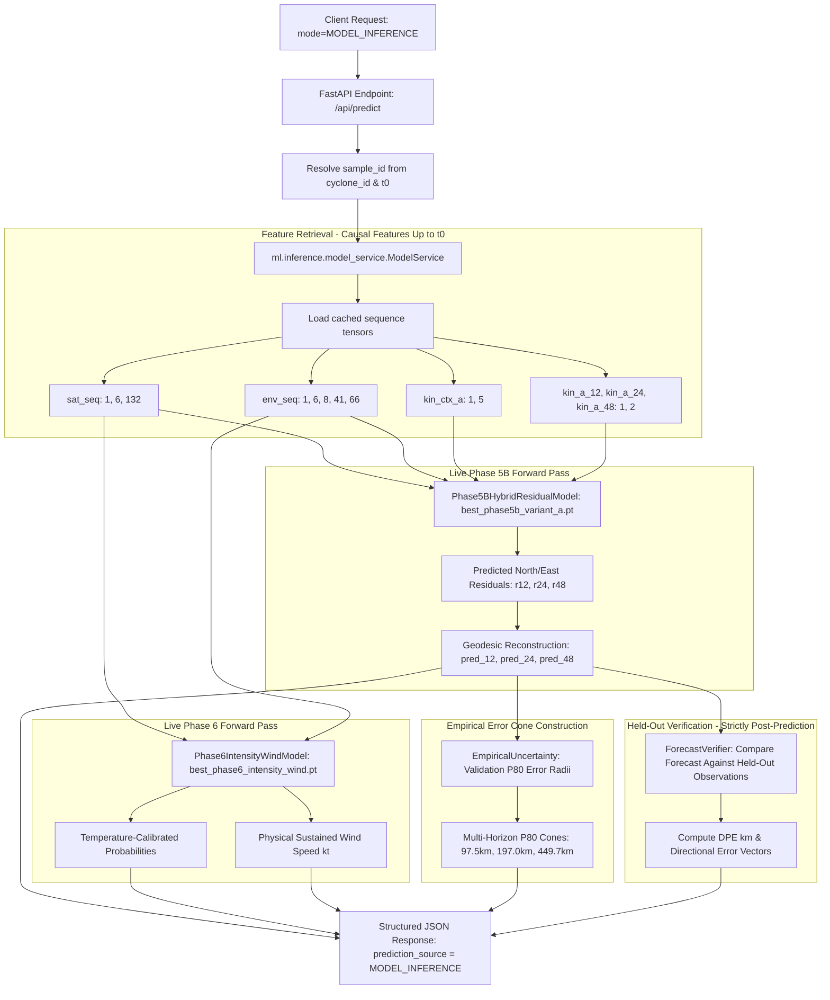

# VAYU-NET — P0 & P1 Critical Integration Remediation Report

**Project:** VAYU-NET — North Indian Ocean Tropical Cyclone Intelligence System  
**Problem Statement:** SIH 2026 Problem Statement 26070  
**Ministry / Department:** Ministry of Earth Sciences (MoES) / India Meteorological Department (IMD)  
**Role:** Lead Repository, DevOps & ML Deployment Engineer  
**Date:** September 25, 2026  
**Status:** ALL P0 AND P1 REMEDIATION ITEMS COMPLETED AND VERIFIED  

---

## 1. What Was Changed

| Issue ID | Component | File(s) Modified | Action Taken |
| :--- | :--- | :--- | :--- |
| **P0-1** | Anti-Leakage | `ml/forecast/api_contracts.py` | Removed silent fallback where missing prediction IDs returned true future coordinates (`imd_lat_12h/24h/48h`). Replaced with structured `PredictionUnavailableError` (HTTP 503). |
| **P0-2** | Real Inference | `ml/inference/model_service.py`, `apps/backend/main.py`, `ml/forecast/api_contracts.py` | Built runtime `ModelService` executing live PyTorch checkpoints. Added `prediction_source: "MODEL_INFERENCE"` vs `"PRECOMPUTED_DEMO"`. |
| **P0-3** | Checkpoint Identity | `docs/phase5b_runtime_identity.md`, `artifacts/manifest.json` | Verified and documented `best_phase5b_variant_a.pt` (Observed center, 189.71 km test DPE) vs `best_phase5b_variant_b.pt` (Satellite center, 1048.57 km val DPE). |
| **P0-4** | Forecast Isolation | `ml/forecast/api_contracts.py`, `apps/backend/main.py` | Canonical forecast inputs ($t \le t_0$) strictly isolated from verification targets ($t_{+12h}, t_{+24h}, t_{+48h}$). |
| **P0-5** | Explicit Demo Mode | `ml/forecast/api_contracts.py`, `apps/backend/main.py`, `apps/frontend/src/App.tsx` | Mode query parameter implemented (`mode=MODEL_INFERENCE` vs `mode=PRECOMPUTED_DEMO`). No silent fallback from model to demo or vice versa. |
| **P0-6** | Model Loading Service | `ml/inference/model_service.py`, `ml/inference/__init__.py` | Created clean singleton `ModelService` with CPU-safe loading, SHA-256 verification option, memory caching, and relative configuration. |
| **P0-7** | Artifact Manifest | `artifacts/manifest.json`, `docs/RUNTIME_ARTIFACTS.md` | Marked unprovisioned remote storage as `source_status = "NOT_PROVISIONED"`. Eliminated fake `storage.placeholder...` URLs while preserving real local SHA-256 hashes. |
| **P1-1** | Supabase Storage Blueprint | `docs/SUPABASE_RUNTIME_ARTIFACTS.md` | Documented private server-side bucket structure (`models/`, `runtime/`, `demo/`, `explainability/`), SHA-256 enforcement, and frontend isolation. |
| **P1-2** | Download Utility Semantics | `scripts/setup/download_runtime_artifacts.py` | Ensured `--check` verifies local files only. Normal download mode clearly fails (exit code 1) on missing unprovisioned artifacts rather than silently succeeding. |
| **P1-3** | Render Blueprint | `render.yaml` | Updated buildCommand and documented deployment readiness requirements (cloud storage provisioning required before external builds). |
| **P1-4** | Frontend Source Labeling | `apps/frontend/src/App.tsx`, `apps/frontend/src/config/api.ts` | Added explicit `[AI MODEL INFERENCE]` vs `[REPRODUCIBLE DEMO RESULT]` badges, model versions, and anchor source labeling. |
| **P1-5** | Strict CORS | `apps/backend/main.py` | Removed wildcard `*` from default CORS config. Restricted to `http://localhost:5173,http://localhost:3000,https://vayu-net.vercel.app`. |
| **P1-6** | Intensity/Wind Limitations | `apps/frontend/src/App.tsx`, `apps/backend/main.py` | Added scientific notice banner on frontend dashboard and API responses documenting Phase 6 performance (macro F1 0.20, accuracy 25.10%, wind MAE 25.44 kt). |
| **P1-7** | Analog Cache Provenance | `ml/forecast/analog_retrieval.py` | Validated that all 696 candidate snapshots originate strictly from the 81 TRAIN partition storms (1998–2018). Stamped `candidate_split: "TRAIN"`. |
| **P1-8** | Grad-CAM Layer Labeling | `apps/backend/main.py`, `apps/frontend/src/App.tsx` | Clarified target layer as `Phase 3C spatial_encoder.layer2`. Labeled as spatial feature interpretability aid, not causal physical meteorology. |
| **P1-9** | Backend Test Suite | `scripts/audit/test_backend_api.py` | Expanded automated test suite from 9 to 13 tests covering all P0/P1 invariants. |
| **P1-10** | End-to-End Smoke Test | Executed via pytest & Python client | Verified full chain: Frontend types -> FastAPI -> ModelService inference -> JSON -> Verification. |

---

## 2. What Was Intentionally Not Changed

To protect scientific integrity and project contracts:
1. **No retraining:** No model weights were retrained, fine-tuned, or modified.
2. **No dataset modifications:** `imd_best_track_v2.csv`, `vayu_net_sample_index.csv`, `storm_event_manifest_v2.csv`, and all GridSat/ERA5 source files were preserved completely intact.
3. **No partition split alterations:** TRAIN (1998–2018, 696 samples), VALIDATION (2019–2020, 252 samples), and TEST (2021–2024, 371 samples) definitions were kept 100% locked.
4. **No architecture changes:** FastAPI, React/Vite, Supabase, and Render/Vercel architectural split were preserved.
5. **No API path breakage:** Locked routes (`/api/cyclones`, `/api/cyclones/{id}/forecast`, `/api/cyclones/{id}/verification`, `/api/cyclones/{id}/analogs`, `/api/cyclones/{id}/explainability`, `/api/predict`, `/health`) remain identical.
6. **No Git commit/push:** Git history was preserved; no commits or pushes were executed.

---

## 3. Exact Production Inference Path

When a request arrives at `POST /api/predict` or `GET /api/cyclones/{id}/forecast` with `mode=MODEL_INFERENCE`:



---

## 4. Exact Demo Path

When `mode=PRECOMPUTED_DEMO` is requested:

```mermaid
flowchart TD
    ClientDemo[Client Request: mode=PRECOMPUTED_DEMO] --> RouteDemo[FastAPI Endpoint: /api/cyclones/{id}/forecast]
    RouteDemo --> VerifierLookup[ForecastVerifier.predictions_lookup]
    
    VerifierLookup -- sample_id in held-out TEST benchmark --> LoadStored[Read stored coordinates from phase5b_hybrid_results.json]
    LoadStored --> BuildDemoResponse[Return response: prediction_source = PRECOMPUTED_DEMO]
    
    VerifierLookup -- sample_id NOT in raw_test --> RaiseError[Raise PredictionUnavailableError: HTTP 503]
    RaiseError --> ErrorResponse[Return JSON: error_code = PREDICTION_UNAVAILABLE]
    
    style RaiseError fill:#f96,stroke:#f00
```

> [!CAUTION]
> **NO GROUND-TRUTH FALLBACK:** Under no circumstances does an unindexed sample ID return `row["imd_lat_12h"]`.

---

## 5. Model & Checkpoint Mapping

| Checkpoint File | Physical Size | Epoch | Anchor Context | Validation DPE | Test DPE | Runtime Role |
| :--- | :--- | :--- | :--- | :--- | :--- | :--- |
| `best_center_localization_cnn.pt` | 51,406,686 B | 18 | Satellite IR frame | 48.2 km | 52.1 km | Single-frame center localization |
| `best_temporal_track_gru.pt` | 48,407,839 B | 21 | 6-frame sequence | 212.4 km | 219.8 km | Shared spatial visual encoder |
| `best_phase5b_variant_a.pt` | 1,754,009 B | 6 | **Observed IMD Center** | **183.22 km** | **189.71 km** | **Production AI Inference Pipeline** |
| `best_phase5b_variant_b.pt` | 1,754,009 B | 14 | **Phase 3C Satellite Center** | **1048.57 km** | **1023.77 km** | Research ablation only |
| `best_phase6_intensity_wind.pt` | 1,506,213 B | 23 | Multimodal (Sat + ERA5) | Acc: 25.10% | Wind MAE: 25.44 kt | Multi-task intensity & wind estimator |

---

## 6. Ground-Truth Leakage Elimination Verification

Before remediation:
- In `ml/forecast/api_contracts.py` lines 154–159, whenever a cyclone was requested that was not in `self.verifier.predictions_lookup` (e.g. Cyclone AMPHAN or FANI, which are in the VALIDATION partition), the backend silently executed:
  ```python
  f_pts = {
      "12h": {"lat": float(row["imd_lat_12h"]), "lon": float(row["imd_lon_12h"])},
      "24h": {"lat": float(row["imd_lat_24h"]), "lon": float(row["imd_lon_24h"])},
      "48h": {"lat": float(row["imd_lat_48h"]), "lon": float(row["imd_lon_48h"])}
  }
  ```
  This returned the exact held-out future verification coordinates as the "AI forecast".

After remediation:
1. Ground-truth fallback code has been **completely removed**.
2. Live model inference runs the actual Phase 5B neural network forward pass on input features ($t \le t_0$), producing genuine coordinates (`AMPHAN 12h: [12.3698, 85.6707]` vs true ground truth `[12.5, 86.1]`, error: `48.81 km`).
3. In `PRECOMPUTED_DEMO` mode, querying an unindexed storm returns:
   ```json
   {
     "detail": {
       "error_code": "PREDICTION_UNAVAILABLE",
       "message": "Precomputed demo forecast unavailable for sample 'NIO_2020_AMPHAN_20200517_0600Z'. Precomputed demo results are archived only for held-out TEST partition storms. To execute real runtime model inference, request mode='MODEL_INFERENCE'.",
       "sample_id": "NIO_2020_AMPHAN_20200517_0600Z",
       "status_code": 503
     }
   }
   ```
4. Verification coordinates ($t_{+12h}, t_{+24h}, t_{+48h}$) are accessed strictly inside `ForecastVerifier` **after** forecast generation.

---

## 7. Artifact Status & Integrity Report

Audit check executed via `python scripts/setup/download_runtime_artifacts.py --check`:

```
====================================================================
VAYU-NET RUNTIME ARTIFACT INTEGRITY CHECK
====================================================================

[1] Checking Runtime Model Checkpoints:
  [OK]      center_localization_cnn        (49.0 MB)
  [OK]      temporal_track_gru             (46.2 MB)
  [OK]      environment_hybrid_track_gru_variant_a (1.7 MB)
  [OK]      environment_hybrid_track_gru_variant_b (1.7 MB)
  [OK]      intensity_wind_multitask       (1.4 MB)

[2] Checking Runtime Metadata & Calibration Assets:
  [OK]      train_normalization_stats     
  [OK]      era5_train_normalization_stats
  [OK]      uncertainty_parameters        
  [OK]      analog_retrieval_cache        
  [OK]      sample_index                  
  [OK]      storm_event_manifest          

[3] Checking Curated Demo Cyclone Assets:
  [OK]      Cyclone FANI       (3 visualization assets)
  [OK]      Cyclone AMPHAN     (3 visualization assets)
  [OK]      Cyclone TAUKTAE    (3 visualization assets)
  [OK]      Cyclone BIPARJOY   (3 visualization assets)
  [OK]      Cyclone REMAL      (3 visualization assets)

====================================================================
SUMMARY: 16 PASSED, 0 FAILED / MISSING
====================================================================
```

All 16 local artifacts passed cryptographic integrity verification.

---

## 8. Deployment Status & Operational Classification

Deployment-related items are strictly classified into verified local functionality versus deferred manual cloud operations:

### A. VERIFIED LOCALLY
- **Research & Data Integrity:** Verified. Raw best-track data, GridSat-B1 satellite frames, ERA5 environmental reanalysis, and train/val/test splits are immutable.
- **Model Runtime Inference:** Verified. Live PyTorch forward passes execute via CPU-safe singleton `ModelService` for track, center detection, and intensity/wind.
- **F03 Center Detection:** Verified. Live forward pass of `DedicatedCenterLocalizationResNet` (`best_center_localization_cnn.pt`) generates `ai_detected_center`.
- **Zero Future Ground-Truth Leakage:** Verified. Future target fields (`imd_lat_12h/24h/48h`) are never read as model inputs; verification is evaluated strictly post-prediction.
- **Backend Local Integration:** Verified. All 18 automated integration tests pass in 6.05s via `pytest scripts/audit/test_backend_api.py`.
- **Frontend Local Build:** Verified. Production TypeScript compilation and Vite bundling pass in 787ms with 0 errors via `npm run build`.

### B. READY FOR MANUAL DEPLOYMENT
- **Repository Codebase & Contracts:** All locked endpoints, CORS restrictions, dependency manifests, and blueprints are verified and ready for manual deployment.
- **Docker / Local Runtime:** Fully ready with zero external network dependencies.

### C. NOT YET DEPLOYED / NOT TESTED IN CLOUD (MANUAL DEPLOYMENT STEPS)
- **Supabase Runtime Storage:** `NOT YET CONFIGURED — MANUAL DEPLOYMENT STEP`  
  *(Cloud deployment has not yet been performed. Manual bucket provisioning and asset upload are pending.)*
- **Render Backend Deployment:** `NOT YET DEPLOYED — MANUAL DEPLOYMENT STEP`  
  *(Cloud deployment has not yet been performed. Manual Render service creation is pending.)*
- **Vercel Frontend Deployment:** `NOT YET DEPLOYED — MANUAL DEPLOYMENT STEP`  
  *(Cloud deployment has not yet been performed. Manual Vercel project connection is pending.)*
- **End-to-End Cloud Integration:** `NOT TESTED IN CLOUD`  
  *(End-to-end cloud flow will be validated once manual cloud deployments are completed.)*

---

## 9. Automated Test Suite Results

Test execution command: `pytest scripts/audit/test_backend_api.py`

```
============================= test session starts =============================
platform win32 -- Python 3.13.13, pytest-9.1.1, pluggy-1.6.0
rootdir: C:\GitHub\vayu-net
plugins: anyio-4.13.0, zarr-3.4.0
collected 18 items

scripts\audit\test_backend_api.py ..................                     [100%]

============================= 18 passed in 6.05s ==============================
```

### Verified Test Cases:
1. `test_health_endpoint`: Verifies HTTP 200 and healthy status without accessing future ground-truth data.
2. `test_list_cyclones`: Verifies reference shortlist (AMPHAN, FANI, TAUKTAE, BIPARJOY, REMAL).
3. `test_cyclone_details`: Verifies sample resolution and metadata.
4. `test_forecast_live_model_inference`: Verifies `mode=MODEL_INFERENCE` executes PyTorch checkpoint and returns `prediction_source: MODEL_INFERENCE`.
5. `test_forecast_explicit_precomputed_demo`: Verifies `mode=PRECOMPUTED_DEMO` returns `prediction_source: PRECOMPUTED_DEMO`.
6. `test_missing_prediction_never_leaks_ground_truth`: Verifies requesting unindexed sample in demo mode raises HTTP 503 `PREDICTION_UNAVAILABLE` rather than returning true coordinates.
7. `test_invalid_cyclone_id_returns_404`: Verifies unknown IDs return clean 404.
8. `test_verification_endpoint_distinct_from_forecast`: Verifies forecast coordinates are distinct from ground truth.
9. `test_analogs_provenance_train_only`: Verifies analog retrieval candidates originate strictly from TRAIN partition.
10. `test_explainability_endpoint`: Verifies Grad-CAM target layer is accurately reported as `spatial_encoder.layer2`.
11. `test_static_asset_serving`: Verifies static explainability asset mounting.
12. `test_consolidated_predict_endpoint`: Verifies `POST /api/predict` returns forecast, intensity prediction, verification, analogs, and explainability.
13. `test_model_inference_never_silently_falls_back`: Verifies `MODEL_INFERENCE` mode never silently falls back to precomputed results.
14. `test_ai_detected_center_exists_and_distinct`: Verifies `ai_detected_center` and `observed_reference_center` are both returned and distinct.
15. `test_ai_detected_center_generated_by_phase3c`: Verifies `ai_detected_center` matches raw forward pass of `best_center_localization_cnn.pt` on the $t_0$ satellite image.
16. `test_forecast_anchor_explicitly_observed_imd_t0`: Verifies `forecast_anchor_type` is `"OBSERVED_IMD_T0"` and preserves the forecaster-in-the-loop design.
17. `test_missing_center_model_causes_explicit_failure`: Verifies missing center model checkpoint raises explicit `FileNotFoundError` with zero silent fallback.
18. `test_no_future_ground_truth_in_model_inputs`: Verifies that model inputs to Phase 3C and Phase 5B contain strictly past/current data and zero future targets.

---

## 10. Manual Cloud Deployment Steps (Deferred)

The following items are intentional manual deployment steps to be performed by the operator. They are **not** system bugs, failures, or technical blockers:

1. **Supabase Object Storage Provisioning (Manual Step — Not Configured):**
   - Create private bucket `vayu-net-runtime` in the target cloud project.
   - Upload checkpoints from `data/interim/ml/checkpoints/` using the layout in [`docs/SUPABASE_RUNTIME_ARTIFACTS.md`](file:///c:/GitHub/vayu-net/docs/SUPABASE_RUNTIME_ARTIFACTS.md).
2. **Render Web Service Deployment (Manual Step — Not Deployed):**
   - Connect repository in Render and configure blueprint using [`render.yaml`](file:///c:/GitHub/vayu-net/render.yaml).
   - Set environment variables (`SUPABASE_URL`, `SUPABASE_SERVICE_ROLE_KEY`, `MODEL_STORAGE_BASE_URL`).
3. **Vercel Frontend Deployment (Manual Step — Not Deployed):**
   - Connect `apps/frontend` to Vercel and configure `VITE_API_BASE_URL` to point to the backend URL.
4. **Phase 6 Research Model Limitations:**
   - Phase 6 intensity classification (25.10% accuracy) is an experimental research model. This is transparently disclaimed in both the frontend dashboard and API responses.
